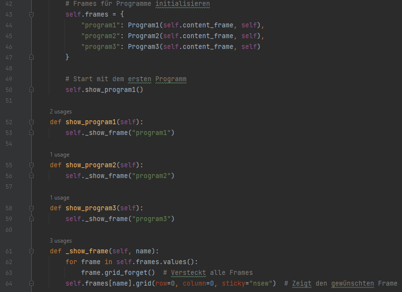
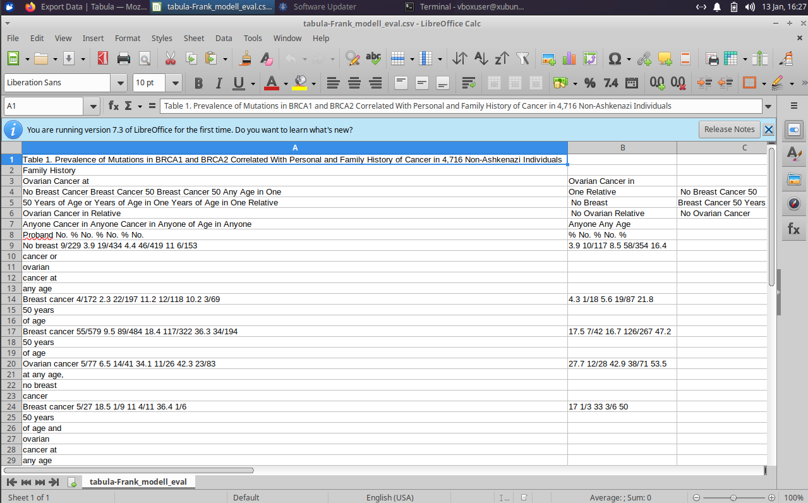

## VER-2-PDF-EDITOR

### Problemstellung

In der Brustkrebsforschung gibt es eine große Menge an Studien, wo zum Beispiel Familien über längere Zeiträume befragt oder beobachtet werden. Ziel dieser Studien ist es, herauszufinden ob es Zusammenhänge zwischen vergangenen Fällen von Brustkrebs in der Familie und aktuellen Fällen gibt. Auf diese Weise kann zum Beispiel das Risikio von Brustkrebs für die folgenden Generationen bestimmt werden, sodass Vorsorgeprogramme entsprechend dem Risiko angepasst werden können. 

Die Ergebnisse dieser Studien werden oftmals in Form von Papern veröffentlicht und sind frei zugänglich. Die Ergebnisse werden oftmals in Form von Tabellen dargestellt und sind in ihrer Form nicht vereinheitlicht. Weiterhin gibt es bisher keine einheitliche Sammlung dieser Ergebnisse in einer Datenbank oder vergleichbaren Datenquellen. Um die Daten einheitlich zu sammeln, müssen die Daten aus den Papern extrahiert werden. Dies kann jedoch eine relativ schwierige Aufgabe sein, da die Tabellen sich teilweise sehr stark in ihrer Form voneinander unterscheiden. 

Das Problem ließe sich zum Beispiel lösen, indem ein Parser entwicklet wird, der automatisch Tabllen in PDF-Dateien erkennt. Dabei treten zwei Probleme auf. Das offensichtlichste ist, dass PDF-Dateien geschützt sein können, sodass nicht lesend auf diese zugegriffen werden kann. Dies tritt bei öffentlichen Forschungsarbeiten relativ selten auf, ist jedoch durchaus möglich. Das zweite Problem ist die eben erwähnte Formatierung der Tabellen. Die Form der Tabellen macht es teilweise unmöglich, diese automatisiert zu verarbeiten ohne in irgendeiner Weise ein kontextverständnis zu haben. Tools wie der Adobe-PDF-Reader machen es möglich, Texte aus den PDF-Dateien zu kopieren bzw. anzupassen. Jedoch stößt dieser Ansatz spätestens dann auf seine Grenzen, wenn die Tabellen mit externen Werkzeugen erzeugt werden und zum Beispiel als .png in die PDF eingefügt wurden.

Um dieses Problem teilweise und halbautomatisch zu lösen, wurde dieses Programm entwickelt. Dabei handelt es sich um eine Art Annotationswerkzeug, welches in drei separarten Schritten versucht, die Texte aus dem PDF zu extrahieren und die Texte wieder zu einer Tabelle zusammenzufügen. 
Das hier vorgestellte Programm ist nur ein Konzept und ein Lösungsvorschlag um das Problem zu lösen und bietet selbstverständlich die Möglichkeit, den Ansatz so weiterzuentwickeln, dass am Ende ein funktionstüchtiges Werkzeug entsteht.

Es sei erwähnt, dass diese Lösung nicht perfekt ist und sicherlich viele Probleme nicht lösen kann. Weiterhin bin ich kein UI-Designer, weswegen die Bedienbarkeit etwas sperrig wirken kann. Hiebei handelt es sich lediglich um eine erste Version umd ein Proof of Concept durchführen zu können. 

### Grundaufbau des PDF-Editors

Im wesentlichen wird das Problem in drei Schritten gelöst:
1. laden und hochskalieren einer PDF-Datei
    - In diesem Schritt hat der Nutzer die Möglichkeit, durch die Seiten der PDF zu navigieren. Dann gibt es verschiedene Buttons. Die Hauptfunktion ist der ROI Markieren Button. Wird er gedrückt, kann der Nutzer eine Bounding-Box um den gewünschten Bereich in Form eines Rechtecks ziehen. Also mit zwei Linksklicks. Der markierte Bereich wird dann in Form eines .png als Datei gespeichert.
    - an der Seite gibt es dann drei verschiedene Buttons um zwischen den Funktionen des Programms zu navigieren

    

2. Tabellen in Bereiche aufteilen
    - Da es ohne Kontextverständnis nicht möglich ist, zu analysieren was zu welchem Teil der Tabelle gehört, muss der Nutzer die Bereich entsprechend markieren
    - Im letzten Schritt wird mithilfe der OCR (Optical Character Recognition) Biblitothek Tesseract die Texte aus den Bildern extrahiert. Tesseract ist in der Lage Strukturelemente wie Linien zu erkennen. Jedoch gibt es auch Tabellen wo keine Linien vorhanden sind. Strukturelemente beeinflussen ebenfalls die Reihenfolge, in der die Texterkennung erfolgt. Dies ist später noch einmal wichtig.

    

    - In diesem Schritt müssen nach und nach die Bereiche des Tabelle markiert werden. Zuerst die Köpfe, dann die Seitenbeschriftung und zuletzt die Hauptbereich der Tabelle.
    - Das Programm iteriert dann durch die Bilder im ROI-Extraktions Ordner.

3. Ausgabe der OCR Erkennung kontrollieren
    - ist der dritte und letzte Schritt
    - der Nutzer kann sich die aufgespalteten Tabellen ansehen
    - mit einem Menü kann zwischen den drei Komponenten gewechselt werden
    - im unteren Bereich wird der aus dem gezeigten Foto extrahierte Text angezeigt
    - der Nutzer hat dann die Möglichkeit diesen anzupassen
    - Speichern mit Strg+S oder dem Button unten links 

    

    - ein noch zu behebendes Prblem ist aktuell die verarbeitungsreihenfolge von Tesseract
    - denkbar wäre ein zusätzlicher Knopf oder eine Option umd festlegen zu können, in welcher Reihenfolge der Text erkannt wurde
    - dies ist hauptsächlich für den Hauptbereich wichtig

### Code Walkthrough des Editors

#### Hauptklasse (class MainApp(tk.Tk):)
- ist eine relativ simpler Aufbau
- wir haben vier Klassen
- die Klasse MainApp stellt unser Ausgangsprogramm dar
- die linke Sidebar ist immer zu sehen
- dann haben wir drei weitere Klassen, die die Unterprogramme darstellen, die wir mit den Buttons aufrufen können:
    - Program1 (PDF laden und Tabellen markieren)
    - Program2 (Tabellen annotieren und aufteilen)
    - Program3 (Texte kontrollieren und Bild anzeigen)

- hier die Initialisierung des Hauptprogramms
- Elemente, die für das Verständnis unwichtig sind lasse ich bewusst weg

- jedes Unterprogramm erhält einen eigenen Frame
- diese werden alle erstellt, angezeigt wird aber immer nur der, mit dem wir arbeiten wollen
- angefangen wird immer beim PDF-Editor
- die gerade nicht verwendeten Frames 2 und 3 werden dann einfach so lange versteckt, bis einer der Buttons betätigt wird
- so wird das Programm beim Wechsel des Unterprogramms einfach neu gerendert

#### PDF-Editor (class Program1(tk.Frame):)

- hier wird zusätzlich ein Parent Frame angegeben, das ist dann einfach die MainApp
- interessant ist hier nur die **draw_roi**, in dieser Funktion wir eine ROI vom Nutzer gezeichnet und angezeigt
- da PDF-Dateien meistens eine relativ schlechte Auflösung haben, wir vorher versucht, die PDF hochzuskalieren
- diese höhere Auflösung ermöglicht eine präzisere Darstellung des Dokuments für die Markierung
- **außerdem verbessert dies deutlich die Erkennungsleistung von tesseract !!!**
- die Speicherung der ROI erfolgt dann ebenfalls in der höchstmöglichen Auflösung
- Tests haben nämlich gezeigt, dass einfache Screenshots von den Tabellen eine zu niedrige Auflösung aufweisen
- dadruch war die OCR-Erkennung extrem schlecht

#### Tabellen aufteilen (class Program2(tk.Frame):)
- viel passiert hier eigentlich nicht
- zuerst wird das Verzeichnis mit den ROIs geladen, welche im vorherigen Schritt extrahiert wurden
- dann gibt es eine kleine Nutzerführung, die dem nutzer sagt was er annotieren soll
- nachdem drei Regionen markiert wurden, wird das nächste Bild geladen
- so wird durch den gesamten Ordner iteriert

- dieser Schnipsel ist noch interessant
- die Bilder werden nicht nur einfach gespeichert, sondern die Koordinaten der Markierungen müssen vorerst noch zurückgerechnet werden auf die originalen Bildkoordinaten
- das liegt auch wieder an der Erhöhung der Auflösung
- bzw. wird das Bild so skaliert, dass nicht erst gescrollt werden muss
- durch das Skalieren wird auch der Platz optimal ausgenutzt
- wenn man fertig mit der Markierung ist, kann auf den Button "Text extrahieren" im ROI Editor geklickt werden
- dann wird einfach nur eine tesseract instanz aufgerufen, welche dann die Texte aus den drei Bildabschnitten extrahiert
- das Ergebnis sind dann .txt Dateien

#### OCR Ausgabe überprüfen (class Program3(tk.Frame):)
- hier werden einfach nur die .txt Dateien und die dazugehörigen Bilder geladen
- das hat den Sinn, um nochmals zu überprüfen, ob die texte auch korrekt erkannt wurden
- außerderm können so ungewünschte Inhalte entfernt werden
- oder aber auch Korrekturen vorgenommen werden

- hier wird das angegebene Verzeichnis geöffnet
- Vorraussetzung hierbei ist, dass auch die drei Ordner existieren, die im vorherigen Schritt durch das Programm erstellt wurden
- außerdem wird geprüft, ob eine .txt zu den Bildern existiert
- sollte keine Datei mit entsprechendem Namen existieren, wird eine leere Datei erstellt

### Weitere Textverarbeitung
- hierbei handelt es sich um den kompliziertesten Schritt und auch den anfälligsten, mit der größten Unsicherheit
- nun müssen die Inhalte von jeweils drei Textdateien in eine einheitliche Darstellung gebracht werden
- für die Beschriftungen ist das relativ einfach, solange tesseract auch seperate Textblöcke erkannt hat
- es gibt Fälle in denen Tesseract bei den Tabellenköpfen horizontal liest
- dadurch kann es sein, dass die Texte nicht in korrekten Blöcken vorliegen
- das tritt meistens dann auf, wenn die Tabelle nicht ausreichend Strukturelemente aufweist
- eine Lösung kann sein, bei der Markierung im ersten Schritt darauf zu achten, einige Linien oder sozusagen zu viel zu markieren, sodass die Parsing Reihenfolge einigermaßen stimmt
- ein ähnliches Problem tritt auch bei den Inhalten auf
- teilweise wird horizontal geparsed und teilweise vertikal

- durch die Linien wird Zeile für Zeile erkannt
- diese Tabelle weist auch keine weiteren Unterteilungen der Tabellenköpfe auf

- bei diesem Bild wir aufgrund von fehlenden Linien von oben nach unten gelesen und von links nach rechts
- weiterhin hat diese Tabelle eine doppelte Unterteilung
- zusätzlich zu den Werten 9/229 wird noch ein prozentualer Anteil angegeben

- es gibt bereits Software, die all das für uns macht
- das erste was man findet ist Tabula
- ich habe das mal getestet
- funktioniert auch mit einer ROI Markierung
- die Koordinaten der Tabelle werden gesucht 
- der text zwischen den koordinaten wird extrahiert

- hier sieht man das ergebnis von Tabula
- habe das für das frank Paper getestet